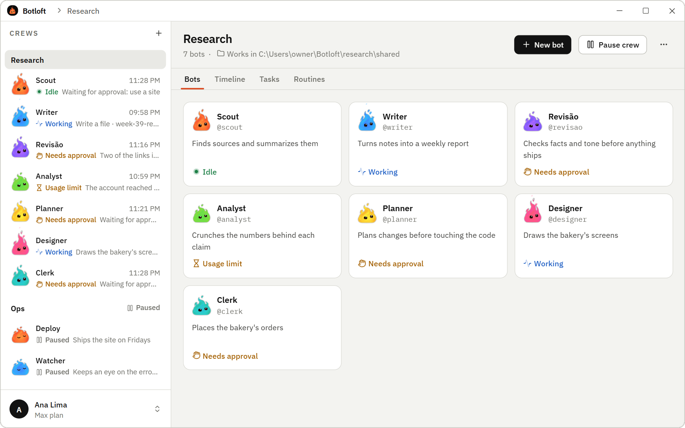
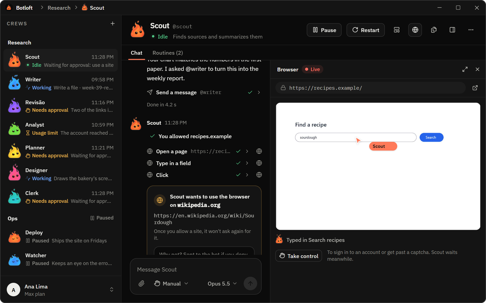
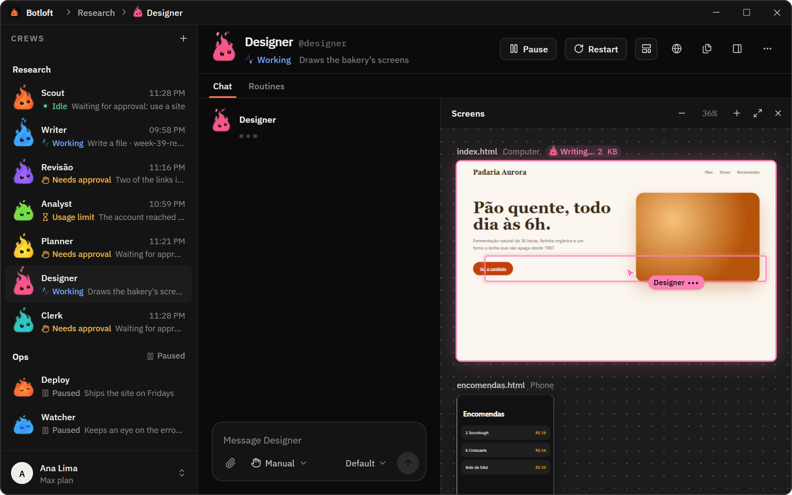
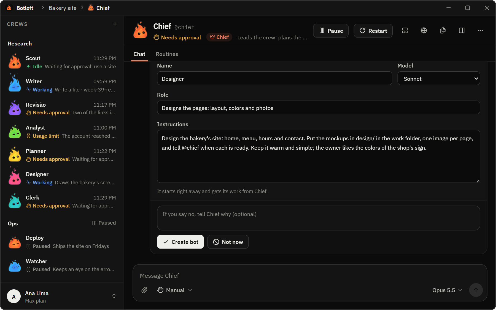
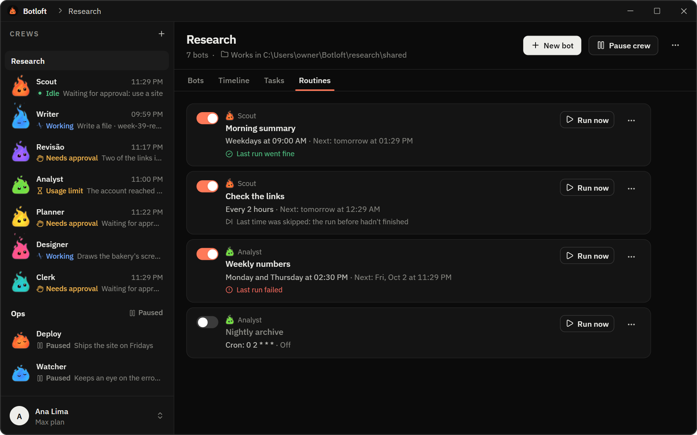
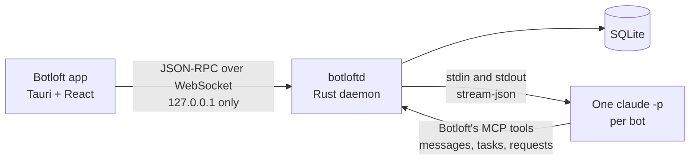

<p align="center">
  
</p>

<h1 align="center">Botloft</h1>

<p align="center">
  <b>A crew of Claude Code bots that stays on and works together on your Windows PC.</b>
</p>

<p align="center">
  <a href="https://github.com/httpsphl/botloft/releases/latest"></a>
  <a href="https://github.com/httpsphl/botloft/actions/workflows/ci.yml"></a>
  
  <a href="LICENSE"></a>
</p>

<p align="center">
  <a href="https://github.com/httpsphl/botloft/releases/latest"><b>Download for Windows</b></a>
  &nbsp;·&nbsp;
  <a href="#what-you-can-do">Features</a>
  &nbsp;·&nbsp;
  <a href="#how-it-works">How it works</a>
  &nbsp;·&nbsp;
  <a href="#faq">FAQ</a>
</p>

<picture>
  <source media="(prefers-color-scheme: dark)" srcset="docs/assets/hero-dark.png">
  
</picture>

Botloft keeps a crew of [Claude Code](https://code.claude.com) bots running on your computer. Each bot has
its own folder, memory and conversation. They pass work to each other, keep going after you close the
window and pick up where they left off after a restart. You talk to each one like in a chat app, and
you decide what they may do.

## What you can do

- **Start a crew from a goal.** Say what the crew is for. Its Chief plans the work and suggests the
  bots it needs; you create each one with a click, or say why not.
- **Chat with every bot.** Replies stream in as they are written. Send images and files. When a bot
  wants to run a command, edit a file or open a website, a card asks you first, unless you told that
  bot it may.
- **Let them hand work to each other.** Bots send messages and tasks to each other. Every message is
  saved before it is sent and retried until it arrives.
- **Watch them work.** See every page a bot opens in its browser, live, and take control to sign in
  for it. Watch the screens it designs take shape while it writes them. Open the files it made.
- **Schedule routines.** Weekday mornings, every two hours or any cron schedule, with missed runs
  and overlaps handled.
- **Leave them running.** Bots keep working after you close Botloft. They start with Windows, come
  back within a minute if something crashes and keep the PC awake while they work. Botloft waits
  near the clock and tells you when a bot needs you.
- **Choose per bot.** How much it asks before acting, and which Claude model it uses. See how much
  of your plan's usage is left.

<table>
  <tr>
    <td width="50%"><br><sub><b>Chat and live browser.</b> Scout asks before using a new site, and you watch it browse.</sub></td>
    <td width="50%"><br><sub><b>Screens.</b> Designer's pages take shape while it writes them.</sub></td>
  </tr>
  <tr>
    <td width="50%"><br><sub><b>A Chief for each crew.</b> It suggests the bots the work needs.</sub></td>
    <td width="50%"><br><sub><b>Routines.</b> Work that runs on a schedule, with the last result at a glance.</sub></td>
  </tr>
</table>

Botloft speaks English, Portuguese (Brazil) and Spanish, follows your light or dark theme and updates
itself.

## Get started

You need Windows 10 or 11 (64-bit) and [Claude Code](https://code.claude.com/docs/en/setup),
installed and signed in once with your Claude account. Bots run on your own Claude plan.

1. Download `Botloft_<version>_x64-setup.exe` from the
   [latest release](https://github.com/httpsphl/botloft/releases/latest) and run it. It installs for
   your Windows user only, with no administrator prompt. The installer is not code-signed yet, so
   Windows SmartScreen may ask you to confirm ("More info", then "Run anyway").
2. Open Botloft. It sets itself up; there is nothing to configure.
3. Create your first crew and tell it what it is for.

When a new version is out, an **Update available** button shows in the title bar. Uninstalling
(Settings > Apps) removes the app and stops Botloft from running in the background. Your bots and
their files stay in `%LOCALAPPDATA%\Botloft` and `%USERPROFILE%\Botloft`.

## How it works



- **The daemon is the source of truth.** Closing the app never stops a bot. `botloftd` runs as a
  scheduled task of your Windows user: it starts when you sign in and comes back within a minute if
  it dies.
- **Claude Code is the runtime.** Each bot is a real `claude -p` session with its own workspace,
  memory (`CLAUDE.md`) and conversation. There is no custom agent SDK and no API key to manage.
- **One conversation per bot.** Your messages, messages from other bots and notices from the daemon
  reach the bot in order. What it does comes back as a chat: replies, tool use and requests you
  allow or deny.
- **Durable before delivered.** Every message is written to SQLite before it is sent and retried
  until it is delivered or marked as failed, which you can retry.

The full design, from the protocol to the states of a bot, lives in [`docs/spec.md`](docs/spec.md)
(in Portuguese).

## Privacy and security

- **Local only.** The daemon listens on `127.0.0.1`. No cloud service of our own, no telemetry, no
  accounts. What bots send to Claude goes through Claude Code, as when you use it yourself.
- **You decide what bots may do.** Per bot: ask before anything, accept edits, plan only, or decide on
  its own what needs your OK. Unless it decides on its own, a bot also asks before its first visit
  to each website.
- **Tokens stay safe.** The app authenticates with an owner token readable only by your Windows user.
  Each bot gets its own token per start, and the daemon keeps only its SHA-256 hash.
- **Botloft is not a sandbox.** Every bot runs as your Windows user, so isolation between bots is
  cooperative: a bot can read other bots' folders if it decides to. Give bots only the permissions
  you would give Claude Code directly.

What Botloft sends over the network, what it changes on your computer and how to remove it are in
the [code signing policy](docs/code-signing-policy.md).

## FAQ

<details>
<summary><b>Does Botloft cost anything?</b></summary>

No. Botloft is free and open source under the Apache 2.0 license. The bots run on Claude Code with
your own Claude account, so they use your plan's limits; Botloft shows how much is left.
</details>

<details>
<summary><b>Do I need to keep the window open?</b></summary>

No. The bots run in the background, even after you close Botloft, and start with Windows if you want.
Settings has a switch to stop them when you close the app instead.
</details>

<details>
<summary><b>Where are my bots and their files?</b></summary>

Each bot has a folder under `%USERPROFILE%\Botloft\<crew>\<bot>`, and each crew a shared work folder
that you can point at a project of yours. Botloft's own data (SQLite, logs, secrets) is in
`%LOCALAPPDATA%\Botloft`.
</details>

<details>
<summary><b>Why does Windows warn me when I install it?</b></summary>

The installer is not code-signed yet, so SmartScreen does not know its publisher. Each release is
built by GitHub Actions from this repository, and updates are signed and checked by the app before
they install. The [code signing policy](docs/code-signing-policy.md) says how releases are made and
how to check a download.
</details>

<details>
<summary><b>Does it run on macOS or Linux?</b></summary>

Not yet. Botloft is Windows-first: it uses scheduled tasks, Job Objects and Windows notifications.
</details>

<details>
<summary><b>Is Botloft made by Anthropic?</b></summary>

No. Botloft is an independent open-source project. It uses Claude Code as installed on your computer
and is not affiliated with or endorsed by Anthropic.
</details>

## Status

Botloft is young (version 0.x) and moves fast. The daemon, the chat, crews with a Chief, messages
and tasks between bots, routines, the live browser, screens, the installer and updates are in place.
Planned next: a question box where bots ask you things, "always allow" for requests, search, and a
code-signed installer. `main` can be ahead of the latest release.

<details>
<summary><b>Development</b></summary>

Requirements: Windows 10 or 11, Rust stable (MSVC toolchain), Node.js 24 and pnpm. Running real
bots also needs Claude Code (the native `claude.exe`) installed and signed in.

```powershell
# Daemon and libraries
cargo build -p botloftd
cargo test --workspace
cargo clippy --workspace --all-targets -- -D warnings
cargo fmt --all --check

# Desktop app
cd app
pnpm install
pnpm tauri dev
pnpm dev          # the UI alone in a browser, with a fake daemon and sample crews
pnpm check        # typecheck + Biome + Vitest
pnpm bundle       # NSIS installer with the daemon inside
```

Set `BOTLOFT_HOME` to an absolute path such as `$PWD\.dev\home` during development so the daemon
never touches a real installation in `%LOCALAPPDATA%\Botloft`.

The daemon manages its own scheduled task:

```powershell
botloftd service install     # copy botloftd into the data folder, start it now and at every logon
botloftd service status
botloftd service restart
botloftd service uninstall   # stop it and remove the task; bots and data stay
```

Each data folder gets its own task, so a dev daemon installed with `BOTLOFT_HOME` (or `--home`)
never replaces the real one.

```
crates/botloft-core    domain types, IDs, message envelope, protocol types
crates/botloft-store   SQLite storage and migrations
crates/botloftd        the daemon
app/                   Tauri v2 + React desktop app
docs/                  specification and ADRs
```
</details>

## License

Botloft is licensed under the [Apache License 2.0](LICENSE). See [NOTICE](NOTICE) for the copyright
notice that goes with redistributions. The screenshots show sample crews from the app's preview, not
real data.
